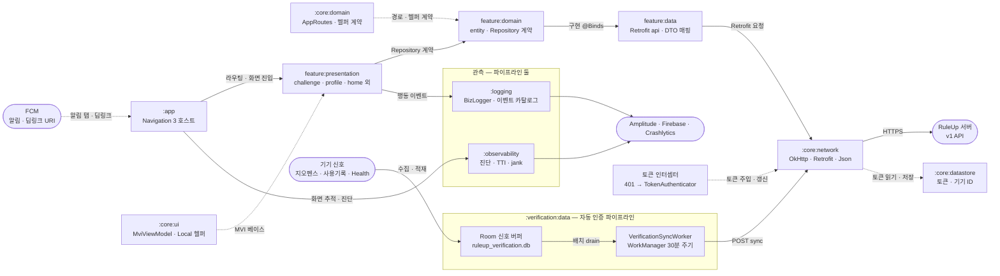
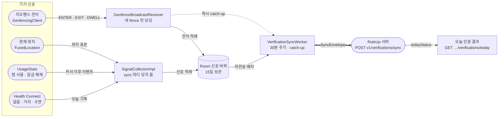
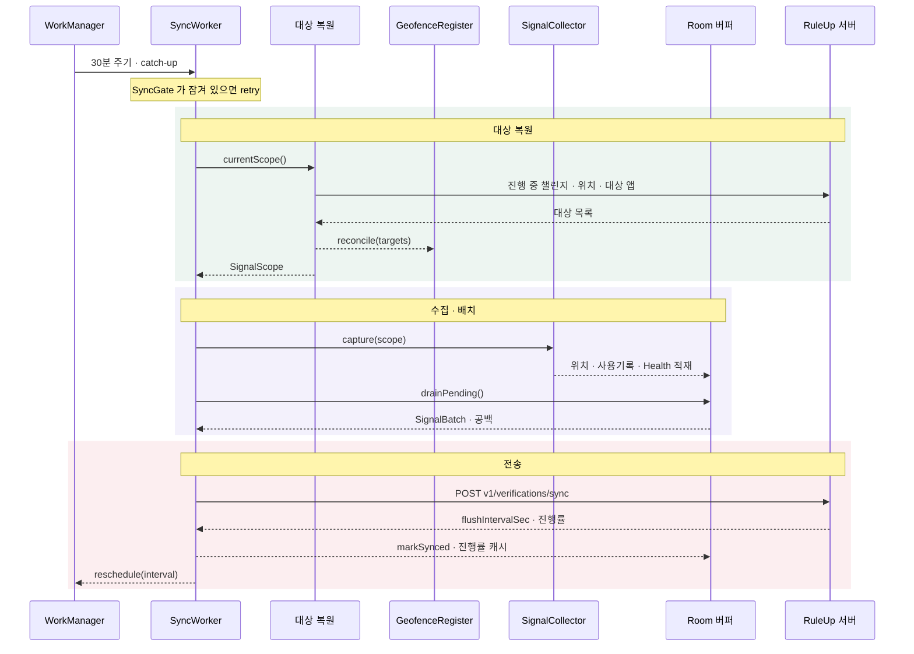

# RuleUp Android

습관 챌린지 앱 RuleUp 의 Android 클라이언트입니다.

챌린지에 참여하면 사용자가 매번 인증 버튼을 누르지 않아도 됩니다. 기기가 모은 신호 —
머문 장소, 앱 사용 시간, 걸음 수, 수면, 첫 잠금 해제 — 를 앱이 30분마다 서버로 올리고,
서버가 그날의 성공·실패를 판정합니다. 앱은 판정하지 않습니다.

DDD · MVI · feature 기반 멀티 모듈 · Navigation 3 · Hilt 로 구성돼 있고,
사용자 행동 로깅(`:logging`)과 진단·성능 계측(`:observability`)이 앱 전체를 가로지르는 모듈로 따로 있습니다.

## 시스템 아키텍처

한 요청은 `:app` 의 라우팅 레지스트리에서 시작해 화면 → Repository 계약 → 구현 → 통신 스택 순으로
한 겹씩만 내려갑니다. 각 layer 는 바로 아래 layer 의 **계약**만 알고 구현은 모릅니다.



> 🔍 인터랙티브 버전: [`docs/architecture.html`](docs/architecture.html)
> 모듈을 눌러 의존 관계만 추리거나 `주요 요청 경로` · `공통 레이어` · `자동 인증 파이프라인` · `관측`
> 네 갈래로 나눠 볼 수 있습니다. 모듈마다 실제 소스 파일로 가는 링크가 붙어 있습니다.
> (GitHub 은 저장소 안의 HTML 을 렌더링하지 않습니다 — 내려받아 브라우저에서 열어 주세요)

**모듈 지도**

| 묶음 | 모듈 | 성격 |
|---|---|---|
| feature | `onboarding` · `challenge` · `profile` · `verification` · `notification` · `support` · `report` (각 `data`/`domain`/`presentation`), `home:presentation` | 화면 단위 기능 |
| core | `core:domain`(JVM) · `core:network` · `core:datastore` · `core:device` · `core:designsystem` · `core:ui` | 둘 이상의 feature 가 쓰는 것만 |
| 관측 | `logging:domain`/`data` · `observability:domain`/`data`/`debug` · `tti:domain`/`data`/`presentation` | 행동 로깅 · 진단 · 성능 |
| host | `app` | 컴포지션 루트 — 라우팅 레지스트리 · Hilt 최상위 · 헬퍼 구현 · FCM · 딥링크 |

**레이어 규칙**

| 레이어 | 아는 것 |
|---|---|
| `presentation` | Compose + `MviViewModel`. 입력은 `Intent`, 출력은 `State` 하나와 일회성 `Effect`. 상태 변이는 `reduce` 한 곳 |
| `domain` | 순수 코틀린. entity 와 Repository **계약**. 협력자를 둘 이상 엮을 때만 UseCase |
| `data` | 그 계약의 구현. `api/` · `dto/` · `repository/` · `di/` 로 나누고 DTO ↔ entity 매핑을 여기서 끝낸다 |

- 의존 방향은 `presentation → domain ← data` 이고, feature 끼리는 **`domain` 까지만** 의존합니다.
- 경로 문자열은 `core:domain` 의 `AppRoutes` 한 곳에만 있고, 화면 이동은 ViewModel 이 `NavigationHelper` 로 합니다.
- 액세스 토큰은 인터셉터가 붙이되 `/auth/oauth` · `/auth/signup` · `/auth/refresh` 는 뺍니다 — 만료 토큰이
  로그인 요청에 실리면 서버가 401 로 막습니다. 401 은 `TokenAuthenticator` 가 갱신합니다.

## 자동 인증 · 신호 수집 파이프라인

RuleUp 의 중심입니다. 인증 방법이 수동(`SELF_CHECK`)이 아닌 챌린지는 **사용자가 앱을 열지 않아도**
기기 신호로 인증됩니다.

설계는 두 문장으로 요약됩니다.

- **먼저 쌓고 나중에 보낸다.** 신호는 받는 즉시 Room(`ruleup_verification.db`)에 들어가고,
  WorkManager 가 30분마다 미전송분을 한 봉투로 올립니다. 네트워크가 끊겨도 신호는 잃지 않습니다.
- **앱은 판정하지 않는다.** 앱이 보내는 것은 신호 · 권한 상태 · 기기 시계 · 수집 공백이고,
  성공·실패는 서버가 정합니다. 앱은 그 결과를 다시 읽어 보여 줄 뿐입니다.



> 🔍 인터랙티브 버전: [`docs/verification-pipeline.html`](docs/verification-pipeline.html)
> `이벤트로 들어오는 신호` · `sync 때 당겨 오는 신호` · `전송과 판정` 세 갈래로 나눠 볼 수 있습니다.

### 인증 방법과 신호

무엇을 모을지는 앱이 정하지 않습니다. sync 마다 진행 중인 챌린지를 서버에서 다시 받아
인증 방법별로 대상을 복원합니다(`RestoreVerificationTargetsUseCase`).

| 인증 방법 | 모으는 신호 | 읽는 곳 | 필요한 권한 |
|---|---|---|---|
| `GPS_PRESENCE` · `GPS_AVOID` | 지오펜스 전이 + 현재 위치 표본 | GMS `GeofencingClient` · `FusedLocationProviderClient` | 정밀 위치 · 백그라운드 위치 |
| `SCREEN_TIME_MAX` · `SCREEN_TIME_MIN` | 대상 앱의 사용 이벤트 | `UsageStatsManager.queryEvents` | 사용 기록 접근 (앱 옵스) |
| `WAKE` | 오늘 첫 잠금 해제 · 첫 화면 켜짐 | 버퍼에 쌓인 사용 이벤트에서 도출 | 사용 기록 접근 |
| `HEALTH` | 오늘 걸음 · 이동 거리 | Health Connect `readRecords` | `READ_STEPS` · `READ_DISTANCE` |
| `SLEEP` | 최근 36시간 수면 세션 (깬 구간 제외) | Health Connect `SleepSessionRecord` | `READ_SLEEP` |
| `SELF_CHECK` | 없음 — 사용자가 직접 제출 | `POST v1/challenges/{id}/verifications` | 없음 |

**신호가 들어오는 길은 두 가지입니다.**

| 길 | 신호 | 언제 |
|---|---|---|
| 이벤트 | 지오펜스 전이 | OS 가 앱을 깨워 준다. 받는 즉시 Room 에 쌓고 **catch-up sync 를 한 번 더 건다** |
| 당겨 오기 | 위치 · 사용기록 · Health · 수면 | sync 가 돌 때마다 읽는다. 사용기록은 커서로 이어 읽고, 첫 회는 24시간 전부터 |

"오늘"의 경계는 기기 시간대가 아니라 **KST 자정**입니다(`ServiceDate.ZONE`). 해외에 있어도 서버와 같은 날을 셉니다.

### sync 한 회차



> 🔍 인터랙티브 버전: [`docs/verification-sync.html`](docs/verification-sync.html)
> 각 메시지에 붙은 주석과 `대상 복원` · `수집 · 배치` · `전송 · 다음 회차` 갈래를 따로 볼 수 있습니다.

1. **대상 복원** — 진행 중 챌린지를 페이지 끝까지 받아 자동 인증인 것만 고르고, 방법별로 대상 위치 · 앱 ·
   Health 항목을 모읍니다. 그 결과로 지오펜스를 reconcile 합니다. 복원이 실패하면 Room 에 남은 지난 대상으로 돕니다.
2. **수집** — 위치 → 사용기록 → Health · 수면 순서로 읽어 Room 에 넣습니다. 권한이 없는 신호는 건너뜁니다.
3. **배치** — 15일이 지난 행을 먼저 지우고(`BUFFER_EVICTED` 공백으로 알림), 미전송 행 전부에 배치 키를 붙여 한 묶음으로 꺼냅니다.
4. **봉투** — 신호에 권한 상태 · 기기 시계와 부팅 세션 · VPN 여부 · Play Integrity 토큰(6시간 캐시) · 진단 값 · 수집 공백을 얹습니다.
   보낼 챌린지도 신호도 공백도 없으면 전송하지 않습니다.
5. **전송** — `POST v1/verifications/sync`. 413 이면 배치를 반으로 쪼개 최대 4단계(16 조각)까지 다시 보냅니다.
6. **마무리** — 성공한 배치만 전송 완료로 표시하고, 다음 주기를 서버가 준 `flushIntervalSec` 으로 다시 잡습니다.

### 언제 도는가

| 계기 | 하는 일 |
|---|---|
| 앱 시작 · 로그인 | 30분 주기 작업을 건다. 이미 있으면 그대로 둔다(`KEEP`) |
| 로그인한 채 콜드 스타트 | `POST v1/verifications/intro` 로 기기를 알리고, 서버가 준 주기로 다시 잡는다 |
| sync 성공 | 응답의 `flushIntervalSec` 으로 주기를 갱신한다. 하한은 15분 |
| 지오펜스 전이 · 대상 앱 저장 | 즉시 catch-up 한 번 (`verification_sync_catchup`) |
| 부팅 완료 | 지오펜스만 다시 등록한다. 주기 작업은 WorkManager 가 스스로 복원한다 |
| 로그아웃 | 주기 · catch-up 취소 → 지오펜스 해제 → Room · DataStore 비우기. 도는 sync 와 겹치지 않게 `SyncGate` 안에서 |

두 작업 모두 네트워크 연결을 조건으로 겁니다. 한 번에 한 회차만 돌도록 프로세스 전체에 뮤텍스(`SyncGate`)가 하나 있고,
잠겨 있으면 그 회차는 retry 로 물러납니다.

### 실패 처리

| 서버 응답 | 처리 | 버퍼 |
|---|---|---|
| `SYNC_TOO_FREQUENT` | retry (WorkManager 백오프) | 그대로 — 다음 회차에 다시 실린다 |
| `INVALID_SIGNAL_PAYLOAD` | retry 하지 않음 | 그대로 — 봉투 계약이 틀린 것이지 신호가 틀린 게 아니다 |
| `SYNC_PAYLOAD_TOO_LARGE` | 16 조각까지 쪼개도 넘으면 포기 | 전송 완료로 표시하고 버린다 |
| 그 밖의 오류 | retry | 그대로 |

실패는 전부 `DIAGNOSTIC` 채널에 `sync_outcome` 속성과 함께 ERROR 로 남습니다(릴리스에서는 Crashlytics).

### 권한과 공백

권한이 빠지면 수집기는 조용히 건너뛰고, 대신 **그 사실을 봉투에 싣습니다.** 서버가 "신호가 없다"와
"권한이 없어서 못 모았다"를 가를 수 있어야 사용자에게 맞는 사유를 보여 줄 수 있기 때문입니다.

| 공백 | 언제 |
|---|---|
| `PERMISSION_MISSING` | 대상이 있는데 그 신호의 권한이 없다 (복구 가능) |
| `GEOFENCE_NOT_REGISTERED` | 위치 권한이 없거나 등록이 실패했다 |
| `USAGE_PURGED` | 사용기록 커서가 5일보다 오래돼 OS 가 이미 지운 구간이 생겼다 |
| `BUFFER_EVICTED` | 15일 · 테이블당 1만 행을 넘겨 보내기 전에 지웠다 |
| `SIGNAL_UNSUPPORTED_DEVICE` · `HC_PROVIDER_UPDATE_REQUIRED` | Health Connect 가 없거나 업데이트가 필요하다 |

서버가 `PERMISSION_MISSING` 으로 보류하면 챌린지 상세에 "권한이 꺼져 있어 측정하지 못했어요"가 뜨고, 거기서
`verification/permission-repair` 화면으로 갑니다. 챌린지를 만든 직후 사용 기록 접근이 없을 때도 같은 화면으로 보냅니다.
이 화면은 돌아올 때(`ON_RESUME`)마다 권한을 다시 읽고, 위치 · 백그라운드 위치 · 사용 기록 · 걸음 · 거리 · 수면을
각자 맞는 경로(런타임 권한 · 사용 기록 설정 · Health Connect)로 엽니다.

### 지오펜스

- `requestId` 는 `{userId}#{challengeId}#{index}` 입니다. 리시버는 **지금 로그인한 사용자의 접두어**이면서
  등록 목록에 있는 fence 만 받습니다 — 로그아웃 직전에 등록된 남의 fence 가 다음 사용자 신호로 섞이지 않습니다.
- 챌린지당 앵커는 최대 3개입니다. 반경은 서버 값이 우선이고 없으면 500m, 머묾 시간은 위치 지정 화면에서 받은 값을 쓰며
  복원 때 이전 값이 없으면 60분입니다.
- 등록은 원형 · 만료 없음 · `ENTER | EXIT | DWELL` 이고, 응답성은 5분과 머묾 시간 중 짧은 쪽입니다.
- reconcile 은 목록에서 빠진 fence 만 지우고 나머지는 전부 다시 등록합니다. 앱 시작 · 부팅 완료 · 매 sync 에서 돕니다.

**이 파이프라인에서 지키는 것**

- 판정 로직을 앱에 두지 않습니다. 기준이 바뀌어도 앱 배포 없이 서버만 바꾸면 됩니다.
- 전송이 성공한 배치만 지웁니다. 실패하면 다음 회차가 같은 행을 다시 태깅해 보냅니다.
- 버퍼는 사용자 단위입니다. 로그아웃은 `SyncGate` 안에서 주기 취소 · 지오펜스 해제 · 버퍼 삭제를 한 번에 합니다.
- 신호가 2시간 넘게 올라오지 않으면 내 챌린지 목록이 경고를 띄웁니다(`ChallengeProgress.STALE_AFTER`).

**아직 없는 것**

- FCM 으로 sync 를 깨우는 경로가 없습니다. `SETUP_REQUIRED` · `PERMISSION_REQUIRED` 데이터 푸시는 받기만 하고 무시합니다.
- 권한을 다시 켜도 즉시 reconcile 하지 않습니다. 다음 sync 나 콜드 스타트에서 반영됩니다.
- 인증 제출 → 판정 결과를 잇는 **행동 이벤트 카탈로그가 없습니다**. 그 퍼널은 지금 Amplitude 로 볼 수 없습니다.

디버그 빌드에서는 `VerifySync` 태그로 회차마다 이렇게 남습니다 (형식):

```
I VerifySync: sync 시작 — scope: geofence=<n>, usage=<n>, health=<n>, sleep=<bool>
I VerifySync: 수집 드레인 — geofence=<n>, location=<n>, usage=<n>, health=<n>, sleep=<n>
I VerifySync:   · geofence <ENTER|EXIT|DWELL> req=<userId#challengeId#index> at=<epoch> acc=<m>m mock=<bool>
I VerifySync: sync 성공 — 갱신=<n>, 무시타입=[...], next=<sec>s, 상한=<bytes>
```

```bash
adb logcat -s VerifySync

# 사용 기록 권한을 설정 화면 없이 켠다
adb shell appops set com.ruleup.android_ruleup GET_USAGE_STATS allow

# 30분을 기다리지 않고 주기 작업을 바로 돌린다
adb shell dumpsys jobscheduler | grep ruleup
adb shell cmd jobscheduler run -f com.ruleup.android_ruleup <JOB_ID>
```

수동 QA 시나리오는 [`VERIFICATION_TEST_PLAN.md`](VERIFICATION_TEST_PLAN.md) 에 있습니다.

## 관측

파이프라인이 둘입니다. 사용자 행동은 수명주기와 전송 순서 보장이 달라서, 게이트가 있는 진단 파이프라인에
태우면 설정 하나로 제품 지표가 통째로 사라질 수 있기 때문입니다.

| 무엇 | 부르는 법 | 모듈 | Firebase Analytics | Amplitude | Crashlytics |
|---|---|---|---|---|---|
| 사용자 행동 | `BizLogger.record(event)` | `:logging` | ○ | ○ | – |
| 성능 (TTI · jank · 메모리) | `Observability.log(PERFORMANCE) { … }` | `:observability` · `:tti` | ○ | ○ | – |
| 에러 · 경고 | `Observability.log(severity, tag) { … }` | `:observability` | – | – | ○ (`WARN` 이상) |

- 이벤트는 각 feature domain 의 `logging/<Feature>Events.kt` 팩토리로만 만듭니다. 시그니처가 곧 스키마이고
  `*EventsTest` 가 이름과 속성을 박아 고정합니다 — 이름을 바꾸면 대시보드가 조용히 비는 대신 테스트가 깨집니다.
- 모든 이벤트에 화면 경로가 붙습니다. `ScreenTracker` 가 내비게이션마다 갱신하고 두 파이프라인이 같은 값을 읽습니다.
- 화면 진입 시간은 `:tti` 가 `VIEW_CREATE` · `BACKEND` · `VIEW_BINDING` · `BIG_PART_LOADING` 네 구간으로 잽니다.

```
D BIZLOG: <event_name> @<screen> user=<userId> {<attrs>}
```

```bash
adb logcat -s BIZLOG
```

어떤 이벤트가 있고 Amplitude 에서 무엇을 볼 수 있는지는 [`OBSERVABILITY.md`](OBSERVABILITY.md) 에 있습니다.

## 내비게이션

Navigation 3 기반이고, 경로 문자열은 한 곳에만 존재합니다.

1. `core:domain` 의 `AppRoutes` — 모든 path 상수
2. feature `domain/navigation/<Name>Page.kt` — typed 인자를 `NavRoute(path, args)` 로 직렬화
3. feature `presentation` — 화면과 ViewModel
4. `:app` 의 `AppRouteRegistry` 에 한 줄 — 하단 탭 · 루트 · 로그인 필요 여부를 여기서 정한다

- `isLoginRequired` 의 기본값은 `true` 입니다. 공개로 열면 `AppRouteAccessPolicyTest` 가 깨져 리뷰를 강제합니다.
- 외부 진입은 App Links `https://android.ruleup.co.kr/inv/...`(친구 초대)입니다. 딥링크는 인증보다 먼저 도착하므로
  `PendingDeepLink` 에 보류했다가 자동 로그인이 끝난 뒤 한 번 소비합니다.
- `MainActivity` 는 `singleTask` 입니다. 인스턴스가 둘이 되면 싱글톤 `NavigationHelper` 신호를 두 NavHost 가 나눠 먹습니다.

## 규칙을 강제하는 테스트

아키텍처 규칙은 문서가 아니라 테스트로 지킵니다. 어기면 `./gradlew test` 가 깨집니다.

| 테스트 | 막는 것 |
|---|---|
| `ArchitectureTest` (Konsist) | domain 의 `android.*` import · domain → data/presentation · presentation ↔ data · `*RepositoryImpl` · `*UseCase` 의 위치 |
| `AppRouteAccessPolicyTest` | 등록되지 않은 경로는 로그인 필요 · 공개 라우트 목록은 비어 있어야 함 |
| ktlint `compose_allowed_composition_locals` | 허용 목록 밖의 새 `CompositionLocal` |

## 빌드

JDK 21. 키와 주소는 소스에 두지 않고 `local.properties` 에서만 읽습니다
(`app/build.gradle.kts` 가 `BuildConfig` · manifest placeholder 로 굽습니다).

```properties
BASE_URL=https://.../
KAKAO_NATIVE_APP_KEY=
KAKAO_REST_API_KEY=
KAKAO_REDIRECT_URI=
GOOGLE_CLIENT_ID=
GOOGLE_REDIRECT_URI=
AMPLITUDE_API_KEY=
```

값이 비어도 빌드는 통과하고 런타임에 조용히 실패합니다 — 증상이 이상하면 여기부터 봅니다.
`AMPLITUDE_API_KEY` 가 비면 Amplitude 출구를 아예 달지 않습니다.
`app/google-services.json` 은 커밋하지 않으며, 파일이 있을 때만 google-services · Crashlytics 플러그인이 붙습니다.

```bash
./gradlew assembleDebug
./gradlew test
./gradlew ktlintFormat     # 커밋 전
./gradlew ktlintCheck lint

# 모듈 하나만 (다른 모듈이 "No tests found" 로 깨지지 않게 스코프를 준다)
./gradlew :verification:data:testDebugUnitTest :verification:domain:test
./gradlew :challenge:domain:testDebugUnitTest --tests "*CreateChallengeUseCaseTest*"
```

CI 는 `main` · `develop` 의 push · PR 마다 `assembleDebug` · `ktlintCheck` + `lint` · `test` 를 돌립니다.
릴리스 서명(업로드 키)은 `keystore.properties` 가 있을 때만 붙습니다 — 자세한 절차는 [`CLAUDE.md`](CLAUDE.md) 의 「릴리즈 서명」.

---

다이어그램 원본은 [`docs/diagrams/`](docs/diagrams) 의 JSON 이고,
[archify](https://github.com/tt-a1i/archify) 로 `docs/*.html` 을 만듭니다.
